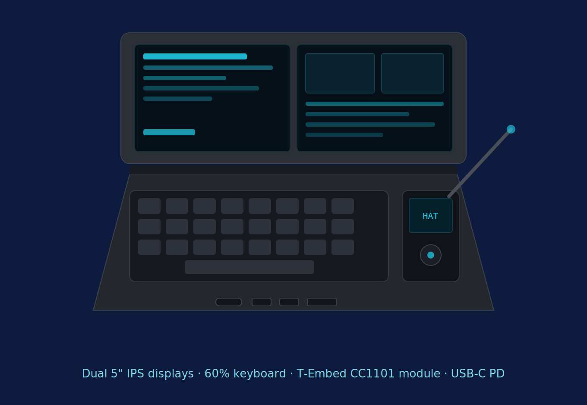
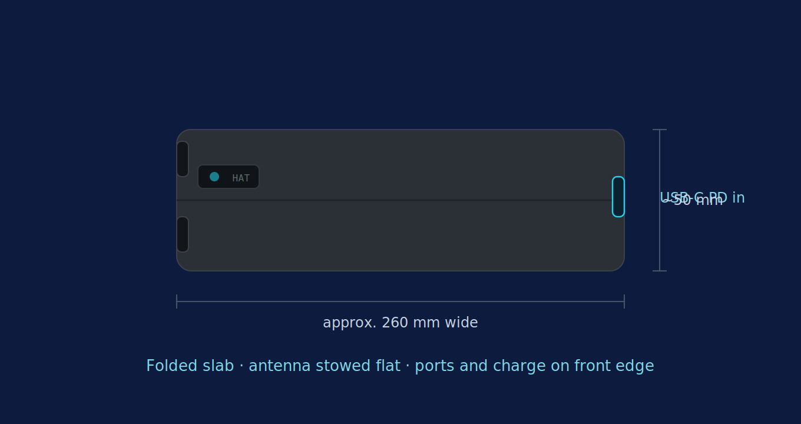

# Cyberdeck Fieldkit

Portable pentest cyberdeck. NUC-based clamshell with an embedded security module (sub-GHz, NFC/RFID, BadUSB, IR, ESP32 WiFi/BLE), built for authorised security testing and travel.

**For use only on networks and devices you own or are explicitly authorised to test.**

## Concept renders

Open clamshell — dual displays, compact keyboard, embedded T-Embed CC1101 module bay and front-edge ports:



Folded travel state — single slab, antenna stowed flat, ports and USB-C charge on the front edge:



Renders are illustrative, not to scale. Dimensions firm up once the panels, keyboard and T-Embed board are sourced and measured. (Source SVGs are in `hardware/mockups/`; the README uses PNGs as GitHub renders those reliably.)

## Spec summary

- **Compute:** Mini NUC (Intel N97/N100 class), runs Kali natively
- **Case:** Clamshell, single hinge, 3D printed (Bambu H2S, PETG)
- **Screens:** Two small panels (5.5"–7" class), mounted where the laptop lid would be, USB-C video
- **Input:** Keyboard bay in the lower half sized for a compact 60–65% board; spare bay depth for a portable mouse when travelling
- **Embedded security module:** ESP32-S3 core + CC1101 (sub-GHz) + PN532 (NFC/RFID) + IR transceiver + USB HID (BadUSB), docked inside the case, USB-connected to the NUC
- **External RF:** Alfa AWUS036AXML (Wi-Fi monitor mode/injection) via USB-C hub
- **Power:** Single USB-C PD input, 100W passthrough, charges NUC + both screens

## Repo layout

```
hardware/
  case/          OpenSCAD parametric case (clamshell, hinge, bays)
  mockups/       Concept renders of the finished build (SVG)
  schematics/    Wiring diagrams for the embedded module
firmware/
  esp32-security-module/   PlatformIO project for the embedded module
docs/
  ARCHITECTURE.md
  BOM.md
.github/workflows/  CI: OpenSCAD render check, firmware build check
```

## Build order

1. Print case shell (`hardware/case/`), fit-check NUC and keyboard bay
2. Assemble embedded module (`firmware/esp32-security-module/`), bench test each sensor before install
3. Fit screens and hinge, route USB-C power/video
4. Flash Kali on NUC, install adapter drivers, pair embedded module over USB serial

## Licence

CC BY-NC-SA 4.0. Copyright © Neil Manfred.
